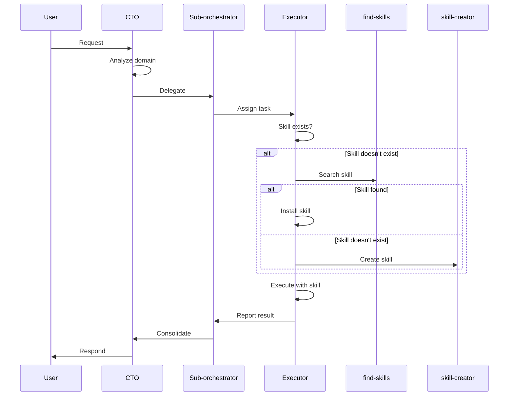

# Agent Orchestrator

This file coordinates the AI agent system for the project. It learns and adapts according to project evolution.

## Fundamental Rules

1. **Single entry point**: All tasks enter through the CTO
2. **Skills restriction**: No agent can execute a task without a specific skill
   - If the skill doesn't exist → use `find-skills` to search
   - If not found → use `skill-creator` to create
   - Only then execute the task
3. **Strict hierarchy**: Tasks flow according to organizational structure
4. **Project learning**: This file is updated with project-specific patterns and conventions

## Agent Structure

```
CTO (Entry point)
├── PM (Product)
│   ├── PO (Requirements)
│   └── UX (Design)
├── QAL (Quality)
│   ├── QA (Testing)
│   └── SecOps (Security)
├── TL (Technical)
│   ├── Architect (Architecture)
│   └── Dev (Development)
├── InfraLead (Infrastructure)
│   ├── DevOps (CI/CD)
│   └── DBA (Databases)
└── DataLead (Data/AI)
    ├── DataEng (Pipelines)
    └── AIEng (AI/ML Models)
```

## Project Learning

### Detected Technology Stack
<!-- Automatically updated according to project analysis -->
- Frontend: (to be detected)
- Backend: (to be detected)
- Database: (to be detected)
- Infrastructure: (to be detected)

### Patterns and Conventions
<!-- Agents add detected project patterns here -->
- File structure: (to be detected)
- Code standards: (to be detected)
- Workflows: (to be detected)

### Skills Installed by Domain
<!-- Record of added skills, organized by domain -->

#### Product
- find-skills ✓
- skill-creator ✓

#### Development
- find-skills ✓
- skill-creator ✓

#### Infrastructure
- find-skills ✓
- skill-creator ✓

#### Quality
- find-skills ✓
- skill-creator ✓

#### Data/AI
- find-skills ✓
- skill-creator ✓

## Delegation Flow



## Agent Configuration

Each agent has its configuration in `.agents/skills/[role]/agents.md` and `.agents/skills/[role]/SKILL.md`.

See complete structure in `SKILL.md` at the root of the project.

## References

- Skills system: https://skills.sh
- Find skills: https://skills.sh/vercel-labs/skills/find-skills
- Create skills: https://skills.sh/anthropics/skills/skill-creator
- Roadmaps by role: https://roadmap.sh
