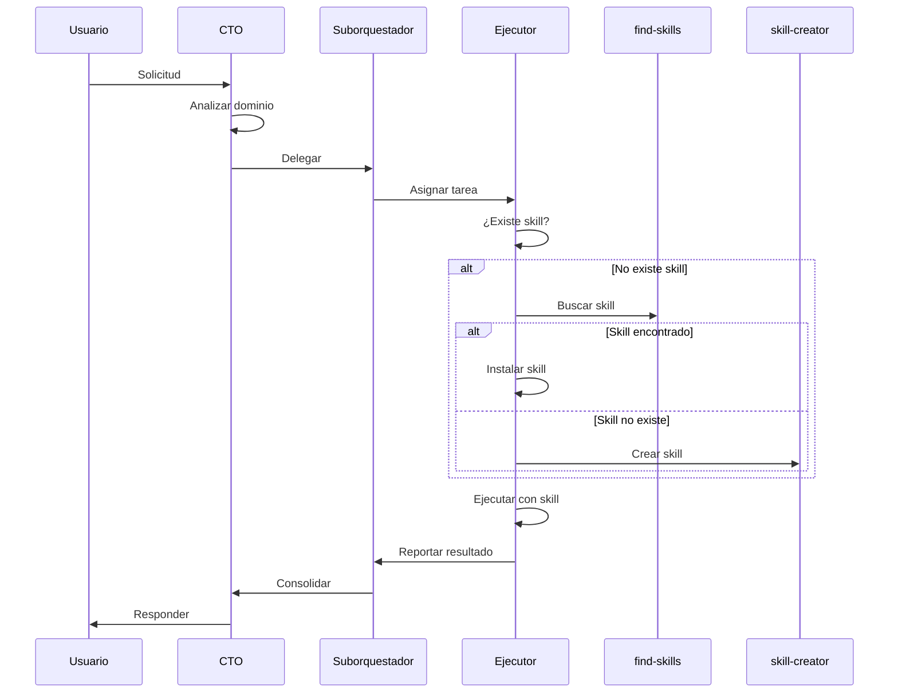

# Agent Orchestrator

Este archivo coordina el sistema de agentes de IA para el proyecto. Aprende y se adapta según la evolución del proyecto.

## Reglas Fundamentales

1. **Punto de entrada único**: Todas las tareas ingresan por el CTO
2. **Restricción de skills**: Ningún agente puede ejecutar una tarea sin un skill específico
   - Si no existe el skill → usar `find-skills` para buscar
   - Si no se encuentra → usar `skill-creator` para crear
   - Solo entonces ejecutar la tarea
3. **Jerarquía estricta**: Las tareas fluyen según la estructura organizacional
4. **Aprendizaje del proyecto**: Este archivo se actualiza con patrones y convenciones específicas del proyecto

## Estructura de Agentes

```
CTO (Punto de entrada)
├── PM (Producto)
│   ├── PO (Requisitos)
│   └── UX (Diseño)
├── QAL (Calidad)
│   ├── QA (Testing)
│   └── SecOps (Seguridad)
├── TL (Técnico)
│   ├── Architect (Arquitectura)
│   └── Dev (Desarrollo)
├── InfraLead (Infraestructura)
│   ├── DevOps (CI/CD)
│   └── DBA (Bases de datos)
└── DataLead (Datos/IA)
    ├── DataEng (Pipelines)
    └── AIEng (Modelos IA/ML)
```

## Aprendizaje del Proyecto

### Stack Tecnológico Detectado
<!-- Se actualiza automáticamente según el análisis del proyecto -->
- Frontend: (por detectar)
- Backend: (por detectar)
- Base de datos: (por detectar)
- Infraestructura: (por detectar)

### Patrones y Convenciones
<!-- Los agentes agregan aquí patrones detectados del proyecto -->
- Estructura de archivos: (por detectar)
- Estándares de código: (por detectar)
- Flujos de trabajo: (por detectar)

### Skills Instalados por Dominio
<!-- Registro de skills agregados, organizado por dominio -->

#### Producto
- find-skills ✓
- skill-creator ✓

#### Desarrollo
- find-skills ✓
- skill-creator ✓

#### Infraestructura
- find-skills ✓
- skill-creator ✓

#### Calidad
- find-skills ✓
- skill-creator ✓

#### Datos/IA
- find-skills ✓
- skill-creator ✓

## Flujo de Delegación



## Configuración de Agentes

Cada agente tiene su configuración en `.agents/skills/[rol]/agents.md` y `.agents/skills/[rol]/SKILL.md`.

Ver estructura completa en `SKILL.md` de la raíz del proyecto.

## Referencias

- Sistema de skills: https://skills.sh
- Buscar skills: https://skills.sh/vercel-labs/skills/find-skills
- Crear skills: https://skills.sh/anthropics/skills/skill-creator
- Roadmaps por rol: https://roadmap.sh
