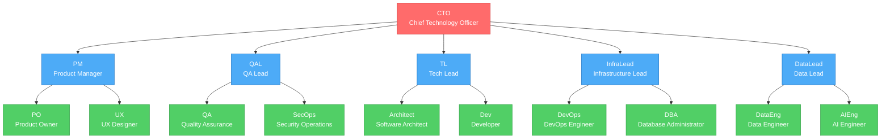

# Sistema de Orquestación para Agentes de IA

## Regla Principal

Toda tarea debe fluir por la jerarquía de roles. Cada rol:
1. Recibe tarea de su superior
2. Ejecuta usando sus skills O delega a subordinados
3. Reporta resultado hacia arriba

## Skills Base (Todos los Roles)

Cada rol inicia con estos 2 skills:

| Skill | URL | Uso |
|-------|-----|-----|
| **find-skills** | https://skills.sh/vercel-labs/skills/find-skills | Buscar skills existentes para su dominio |
| **skill-creator** | https://skills.sh/anthropics/skills/skill-creator | Crear skills nuevos cuando no existen |

```bash
# Instalar skills base
npx skills add vercel-labs/skills --skill find-skills
npx skills add anthropics/skills --skill skill-creator
```

---

## Jerarquía de Roles



**Leyenda:**
- 🔴 **Nivel 1** (Directivo): CTO
- 🔵 **Nivel 2** (Suborquestadores): PM, QAL, TL, InfraLead, DataLead
- 🟢 **Nivel 3** (Ejecutores): 10 roles especializados

---

## Resumen de Roles

### Nivel 1: Directivo
- **CTO**: Orquestador principal → Delega a PM, QAL, TL, InfraLead, DataLead

### Nivel 2: Suborquestadores
- **PM**: Gestión de producto → Delega a PO, UX
- **QAL**: Estrategia de calidad → Delega a QA, SecOps
- **TL**: Liderazgo técnico → Delega a Architect, Dev
- **InfraLead**: Infraestructura → Delega a DevOps, DBA
- **DataLead**: Datos e IA → Delega a DataEng, AIEng

### Nivel 3: Ejecutores
- **PO**: Requisitos y backlog
- **UX**: Diseño de interfaces
- **QA**: Testing funcional
- **SecOps**: Seguridad
- **Architect**: Arquitectura de software
- **Dev**: Implementación de código
- **DevOps**: CI/CD e infraestructura
- **DBA**: Gestión de BD
- **DataEng**: Pipelines de datos
- **AIEng**: Modelos de IA/ML

> **Detalles de cada rol**: Ver `.agents/skills/[rol]/SKILL.md`

---

## Ubicación de Skills por Rol

```
.agents/skills/
├── cto/SKILL.md
├── pm/SKILL.md
├── qal/SKILL.md
├── tl/SKILL.md
├── infralead/SKILL.md
├── datalead/SKILL.md
├── po/SKILL.md
├── ux/SKILL.md
├── qa/SKILL.md
├── secops/SKILL.md
├── architect/SKILL.md
├── dev/SKILL.md
├── devops/SKILL.md
├── dba/SKILL.md
├── dataeng/SKILL.md
└── aieng/SKILL.md
```

---

## Flujo de Orquestación

```
1. Usuario → CTO (recibe tarea)
2. CTO analiza → Delega según dominio:
   - Producto/UX → PM
   - Calidad/Seguridad → QAL
   - Desarrollo/Arquitectura → TL
   - Infraestructura/BD → InfraLead
   - Datos/IA → DataLead
3. Suborquestador → Delega a ejecutor(es)
4. Ejecutor:
   a. ¿Tiene skill? → Ejecuta
   b. ¿No tiene? → find-skills (busca)
   c. ¿No existe? → skill-creator (crea)
5. Ejecutor → Reporta a suborquestador
6. Suborquestador → Reporta a CTO
7. CTO → Responde al usuario
```

---

## Ejemplo: "Crear API REST para usuarios"

```
CTO analiza → Requiere desarrollo + infra + datos
CTO delega a:
  - TL: Diseño y código
  - InfraLead: BD y deployment
  - DataLead: Analytics (opcional)

TL → Delega:
  - Architect: Diseña estructura de API REST
  - Dev: Implementa endpoints y lógica

InfraLead → Delega:
  - DBA: Diseña esquema de BD
  - DevOps: Configura CI/CD y deployment

Cada ejecutor:
  1. Busca skill (ej: Dev busca "express-api")
  2. Si no existe → skill-creator
  3. Ejecuta y reporta a su líder

Flujo de reporte:
Dev → TL → CTO
Architect → TL → CTO
DBA → InfraLead → CTO
DevOps → InfraLead → CTO
CTO consolida → Usuario
```

---

## Referencias

- https://skills.sh — Repositorio de skills
- https://skills.sh/vercel-labs/skills/find-skills — Buscar skills
- https://skills.sh/anthropics/skills/skill-creator — Crear skills
- https://roadmap.sh/ — Base de conocimiento por rol
